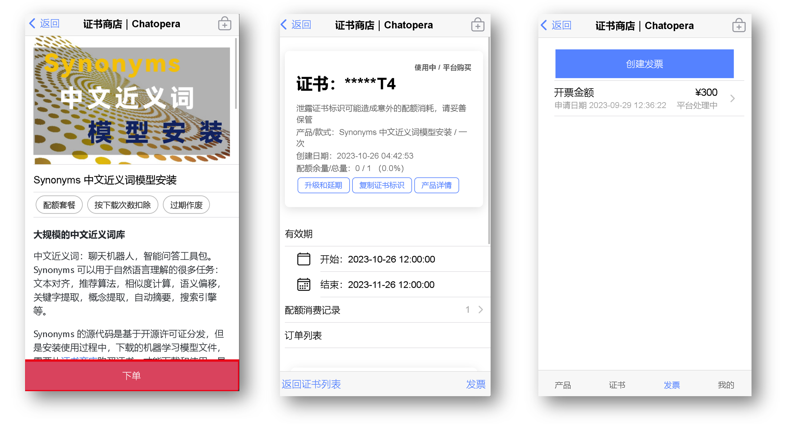
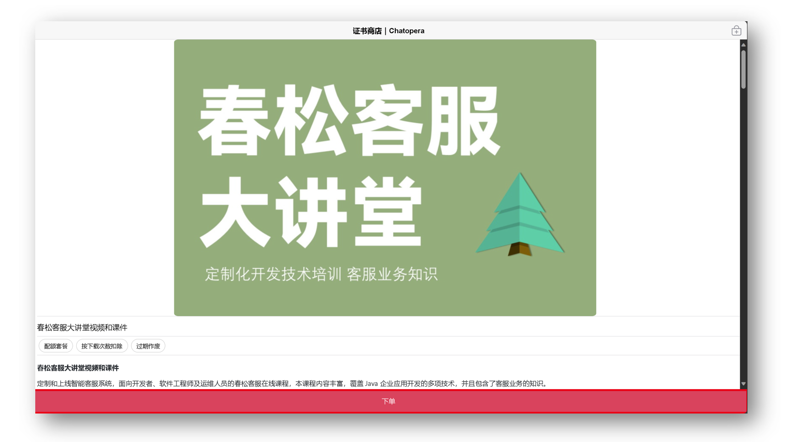
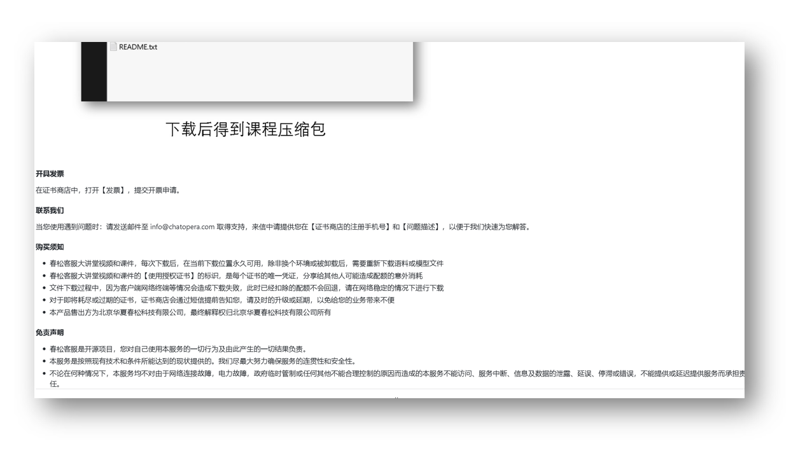
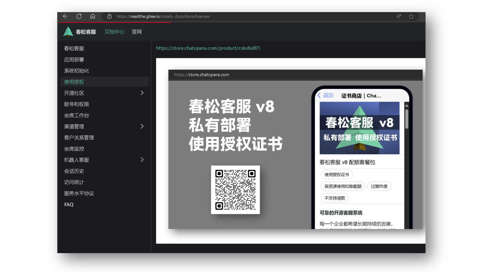
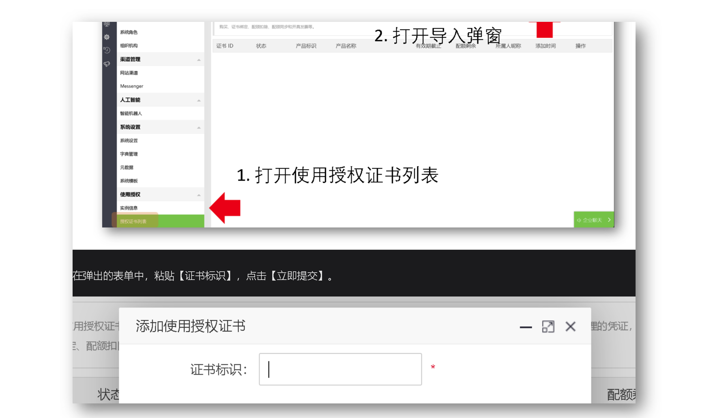
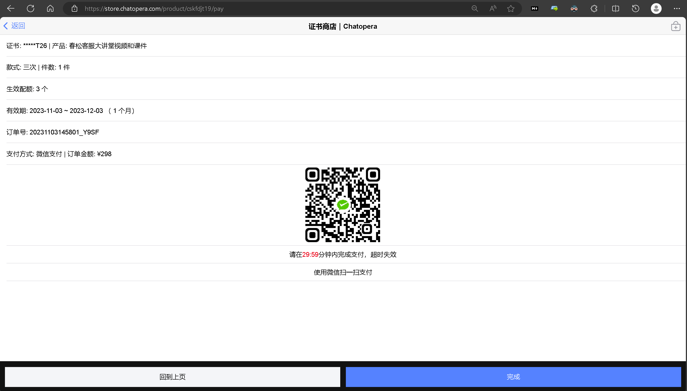
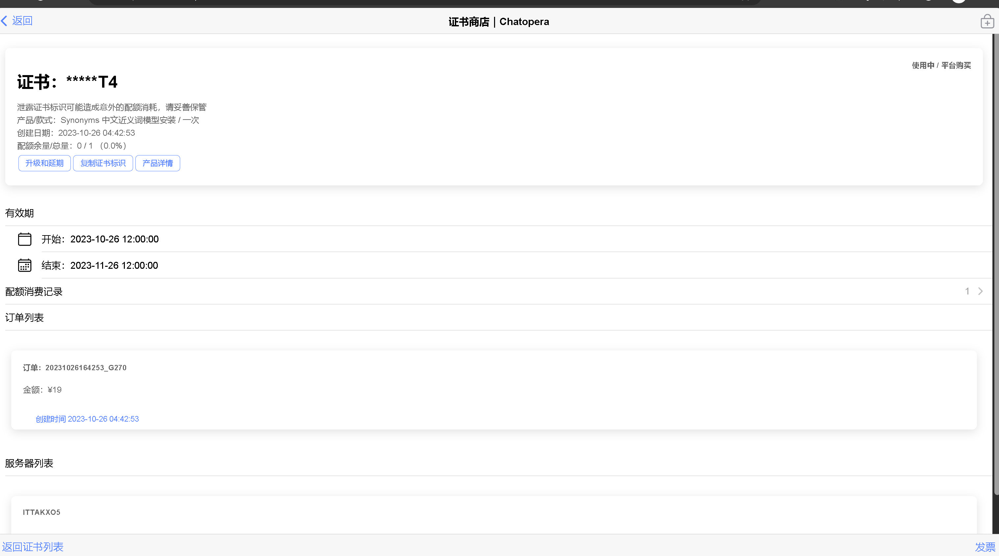
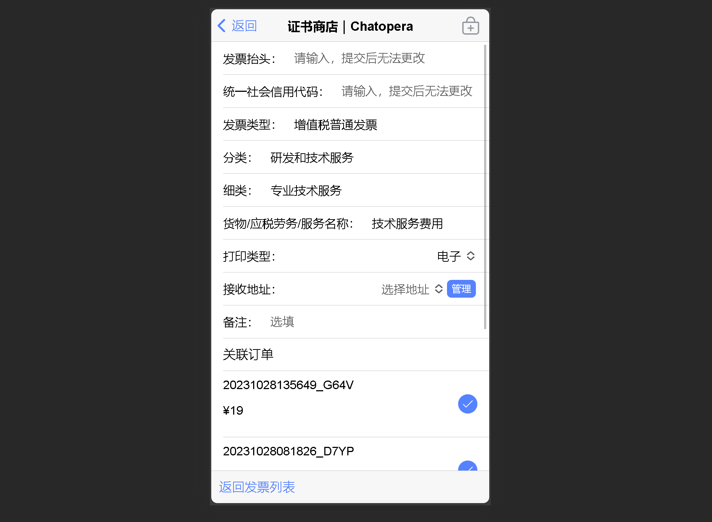
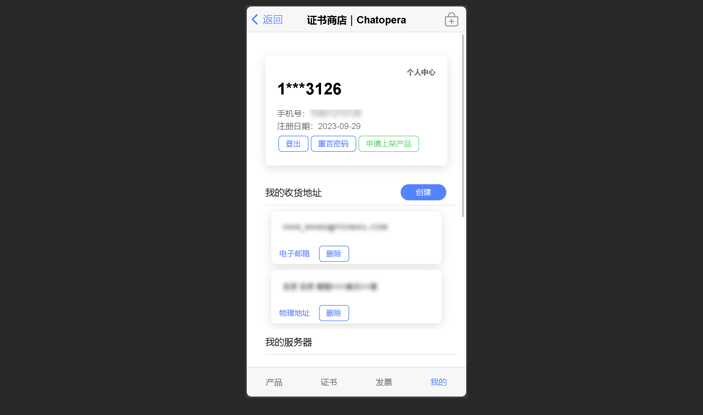

[证书商店](https://store.chatopera.com/)　|　[上架须知](http://onboard.store.chatopera.com/)　|　[申请上架](http://apply.store.chatopera.com/)　|　[联系我们](mailto:info@chatopera.com?subject=%5B%E8%AF%81%E4%B9%A6%E5%95%86%E5%BA%97%5D%20%E6%9C%89%E5%85%B3%E4%BA%A7%E5%93%81%E4%B8%8A%E6%9E%B6%E7%9A%84%E9%97%AE%E9%A2%98%EF%BC%8C%E9%A1%B9%E7%9B%AE%20XXX&body=%E6%82%A8%E5%A5%BD%EF%BC%8CChatopera%20%E8%AF%81%E4%B9%A6%E5%95%86%E5%BA%97%E7%AE%A1%E7%90%86%E5%91%98%0D%0A%0D%0A%E6%88%91%E6%98%AF%20...%0D%0A%E6%88%91%E7%9A%84%E9%A1%B9%E7%9B%AE%E6%98%AF%20...%0D%0A%E9%A1%B9%E7%9B%AE%E5%AE%98%E7%BD%91%20...%0D%0A%0D%0A%E7%8E%B0%E5%9C%A8...)

# Chatopera 证书商店

[Gitee](https://gitee.com/chatopera/store-docs) | [GitHub](https://github.com/chatopera/store-docs) | [Gitcode](https://gitcode.net/chatopera/store-docs)

Chatopera 证书商店是开发者的收银工具， [https://store.chatopera.com](https://store.chatopera.com)

* 支持多中计费策略：按照安装次数、设计计费资源、按照文件大小等
* 支持证书的升级和续费
* 提供保护知识产权的开源许可证 - [春松许可证, v1.0](https://gitee.com/cskefu/CPL-v1/)，开发者可使用
* 消费者证书快要到期或耗尽配额的短信提醒
* 消费者发票可选择快递或电子发票
* 下单后自动通知到 IM 工具服务，实时同步，（支持使用飞书 Webhook）
* 一周内回款，基于【微信支付-网银支付】方案
* 集成速度快：支持多语言 SDK 集成：Python, Nodejs, Java, Php, Ruby, etc.
* 产品专属 URL，每个产品一个 URL 进行推广
* 产品支持多款式，不同的额度、使用期限
* 支持产品附件，在 URL 中通过指定证书标识，基于浏览器下载

# 案例

## 案例 1：Synonyms 中文近义词

* 产品地址：https://store.chatopera.com/product/syns001
* 计费策略：代码运行时下载文件，按照下载次数计费；Synonyms 中，文件为机器学习语言模型
* 项目地址：https://github.com/chatopera/Synonyms
* 证书使用文档：[README.md](https://github.com/chatopera/Synonyms)

## 案例 2：春松客服大讲堂

* 产品地址：https://store.chatopera.com/product/cskfdjt19
* 计费策略：下载产品附件，按照下载次数计费；春松客服大讲堂为培训课程，附件为 ~3.5 GB 的视频和课件
* 项目地址：https://github.com/cskefu/cskefu-djt
* 证书使用文档：[README.md](https://github.com/cskefu/cskefu-djt)

## 案例 3：春松客服

* 产品地址：https://store.chatopera.com/product/cskefu001
* 计费策略：设计业务场景中的计费资源，创建资源消费证书的额度；春松客服中的座席、渠道、联系人等的创建个数
* 项目地址：https://github.com/cskefu/cskefu
* 证书使用文档：https://docs.cskefu.com/docs/licenses

# 购买者的自助服务

### 浏览产品

### 下单

### 证书详情

### 开发票

### 管理个人信息

# 我要上架

## 填写表单申请上架

[http://apply.store.chatopera.com](http://apply.store.chatopera.com)

